```{r setup, include = FALSE}
options(htmltools.dir.version = FALSE)
library(knitr)
library(xaringanExtra)
library(showtext)
library(kableExtra)
opts_chunk$set(echo=FALSE)

# set engines
knitr::knit_engines$set("markdown")

xaringanExtra::use_panelset()
# xaringanExtra::use_share_again()
xaringanExtra::use_tile_view()

```

```{r xaringan-themer, include=FALSE, warning=FALSE}
library(xaringanthemer) 
style_mono_light(base_color = "#23395b")
```

class: center, middle


---
class: inverse
name: case panelset

Case 1

.panelset[

.panel[.panel-name[Clinical Presentation]

.big[A patient with subacute onset of shortness of breath. Her presentation is not that of an acute febrile illness.]

] <!--end of panel-->

.panel[.panel-name[Chest Radiography]

</br>

```{r fig.align='center', out.width='55%'}
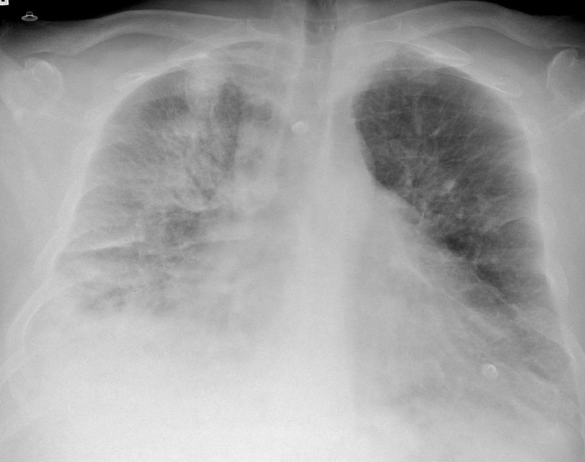
```


] <!--end of panel-->

.panel[.panel-name[Computed Tomography]

.small[Representative CT images]

</br>

```{r out.width='120%'}
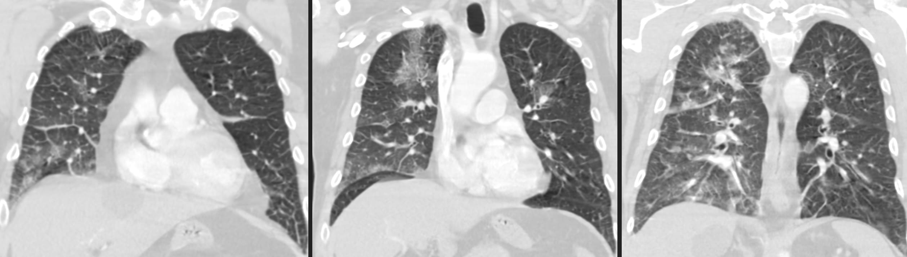
```


] <!--end of panel-->

.panel[.panel-name[Explication]

.pull-left.w40[.grey[Imaging findings]
* asymmetric right lung opacities on radiography
* opacities represent interstitial edema (septal lines; peri-bronchial fluid cuffs; subpleural edema) and foci of alveolar edema, particularly in the right upper lobe

</br>

.grey[Cardiac Ultrasound]


```{r fig.align='center', out.width='100%'}
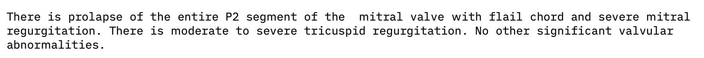
```
]

.pull-right.w60[
```{r fig.align='center', out.width='80%'}
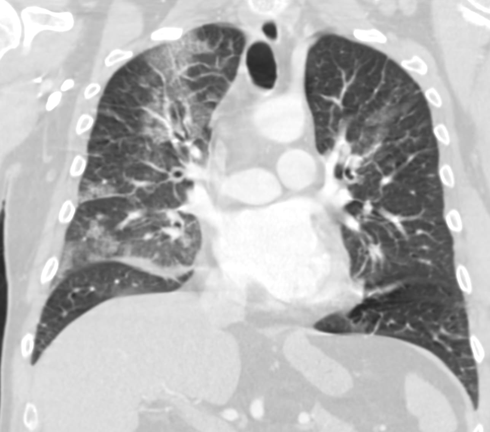
```
]

] <!--end of panel-->

] <!--end of panelset-->

---

class: inverse
name: case panelset

Case 2

.panelset[

.panel[.panel-name[Clinical Presentation]

.big[Unexplained productive cough of several months' duration.]

] <!--end of panel-->

.panel[.panel-name[Chest Radiography]

</br>

```{r fig.align='center', out.width='40%'}
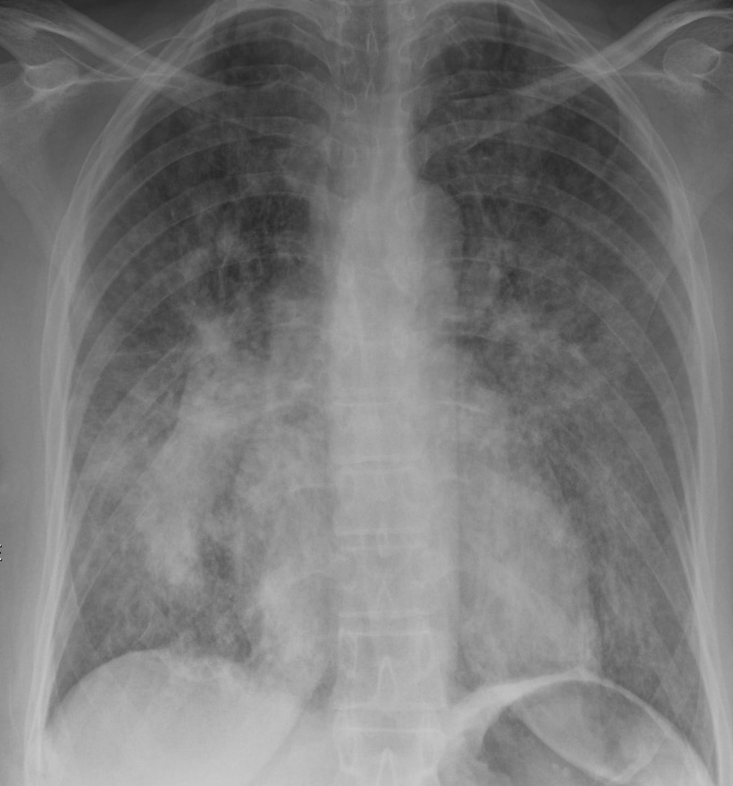
```


] <!--end of panel-->

.panel[.panel-name[Computed Tomography]

<div style="text-align:center;">
<iframe class="pacsbin"
         id="case2"
         src="https://www.pacsbin.com/c/bkvKnPKwwv?s=614b96f2de8c4b0152060cac&i=614b96f2de8c4b0152060cad&ww=1596&wc=-578an=false&header=false&notes=false&overlay=false" 
         style="width: 500px; height: 500px; border: 0;"></iframe>
</div>

] <!--end of panel-->

.panel[.panel-name[Explication]

.pull-left[.grey[Imaging Findings]

.small[

* large right lower lobe mass consistent with primary cancer
* diffuse ground-glass opacities and
* *cheerios* in the lower lungs

The diffuse opacities are consistent with aerogenous spread of tumor.]

```{r fig.align='center', out.width='100%'}
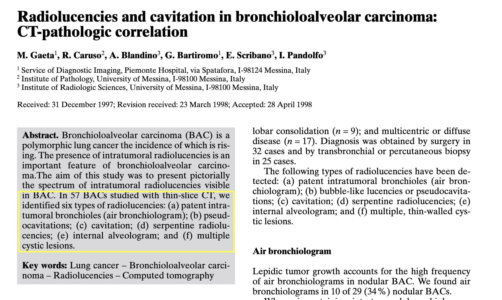
```

]

.pull-right[.grey[Pathology Report]

</br>

```{r fig.align='center', out.width='100%'}
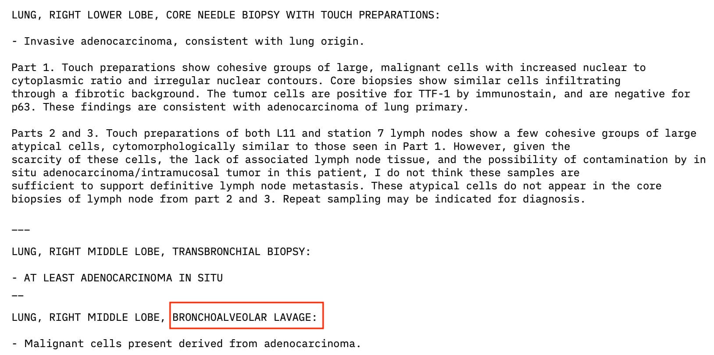
```
]


] <!--end of panel-->

] <!--end of panelset-->

---

class: inverse
name: case panelset

Case 3


.panelset[

.panel[.panel-name[Clinical Presentation]

.big[Bedside radiography in an I.C.U. patient.]

] <!--end of panel-->

.panel[.panel-name[CXR at 4:30 a.m.]

</br>

```{r fig.align='center', out.width='45%'}
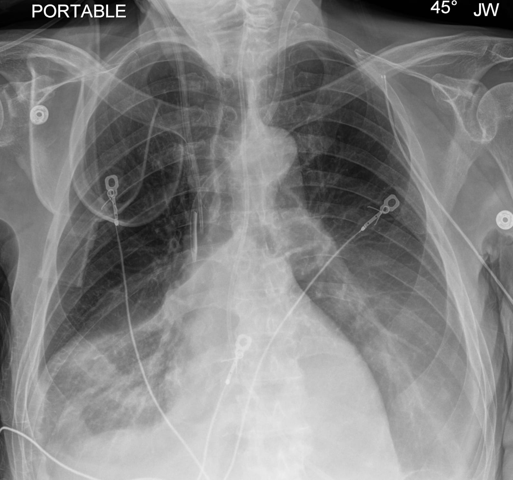
```


] <!--end of panel-->

.panel[.panel-name[CXR at 5:38 p.m.]

.small[What has evolved since earlier in the day ?]

```{r fig.align='center', out.width='48%'}
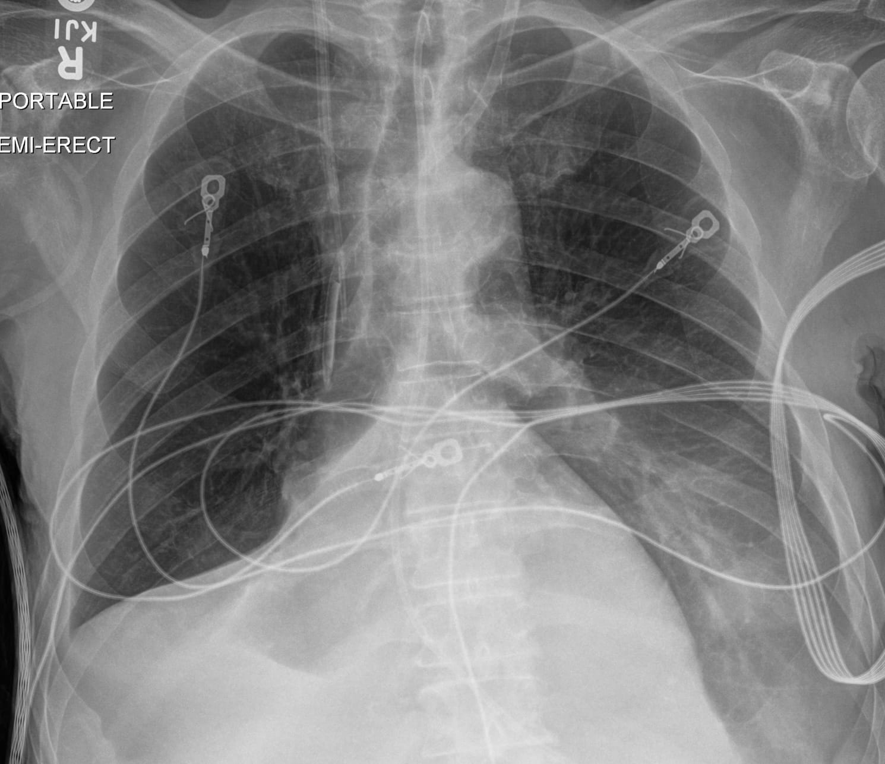
```


] <!--end of panel-->

.panel[.panel-name[Explication]

.pull-left[.grey[Right middle and lower lobe atelectasis]

```{r fig.align='left', out.width='75%'}
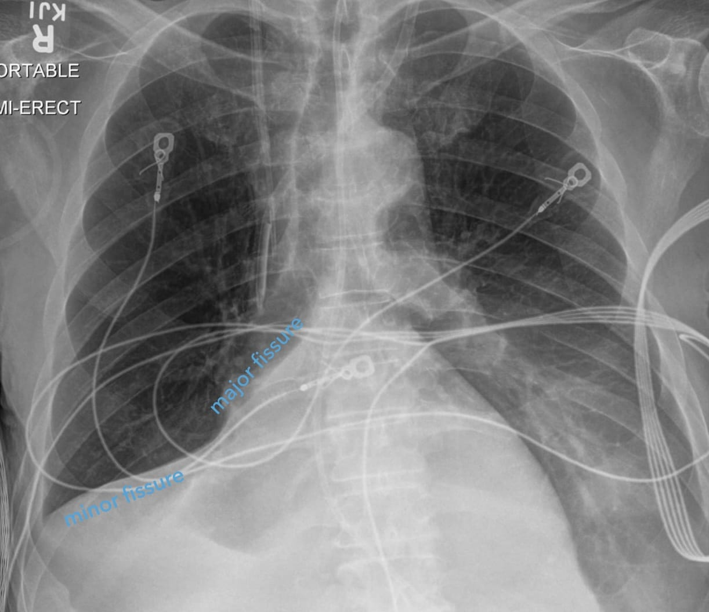
```

]

.pull-right[

```{r fig.align='center', out.width='90%'}
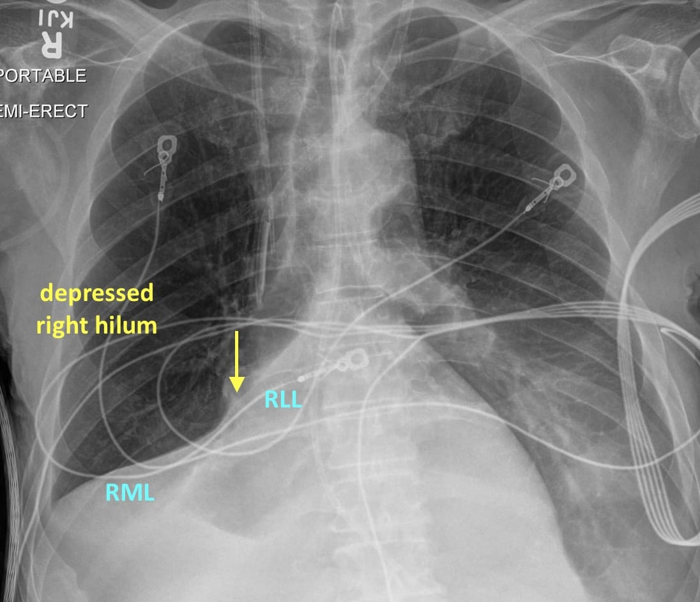
```

]

] <!--end of panel-->


] <!--end of panelset-->

---

class: inverse
name: case panelset

Case 4

.panelset[

.panel[.panel-name[Clinical Presentation]

.big[Post-operative radiography after unventful replacement of the aortic valve and the ascending aorta.]


] <!--end of panel-->

.panel[.panel-name[Radiography]

```{r fig.align='center', out.width='55%'}
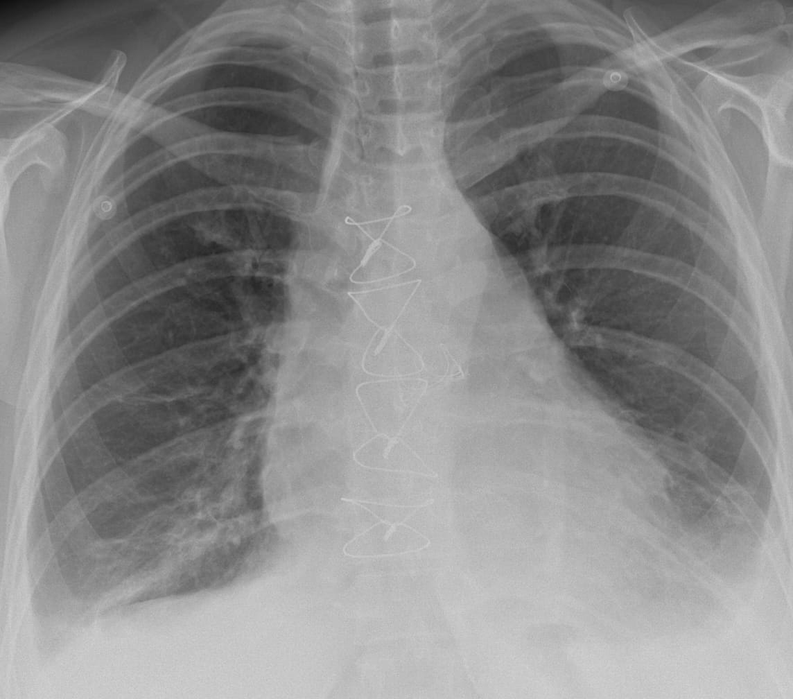
```

] <!--end of panel-->

.panel[.panel-name["Routine" pre-discharge CTA same day]

<div style="text-align:center;">
<iframe class="pacsbin"
         id="case4"
         src="https://www.pacsbin.com/c/b1RnkpFvPP?s=614b9f60de8c4b0152065abc&i=614b9f60de8c4b0152065abd&ww=829&wc=50&an=false&header=false&notes=false&overlay=false" 
         style="width: 500px; height: 500px; border: 0;"></iframe>
</div>


] <!--end of panel-->

.panel[.panel-name[Explication]

.pull-left[.grey[Operative findings]

* no pus
* Surgicel surrounded by fluid

]

.pull-right[

</br>

```{r fig.align='center', out.width='100%'}
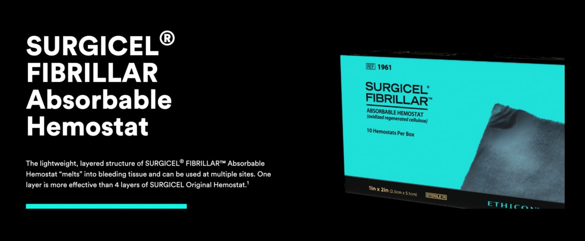
```

]


] <!--end of panel-->


] <!--end of panelset-->

---

class: inverse
name: case panelset

Case 5

.panelset[

.panel[.panel-name[Clinical Presentation]

.big[A patient with a long history of progressive dyspnea on exertion]

] <!--end of panel-->

.panel[.panel-name[Chest Radiography]

.pull-left[

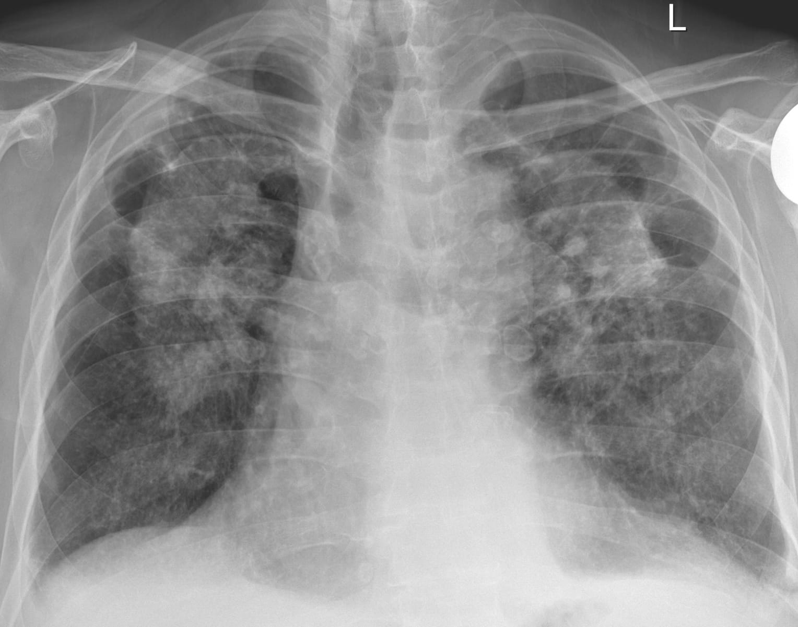]

.pull-right[

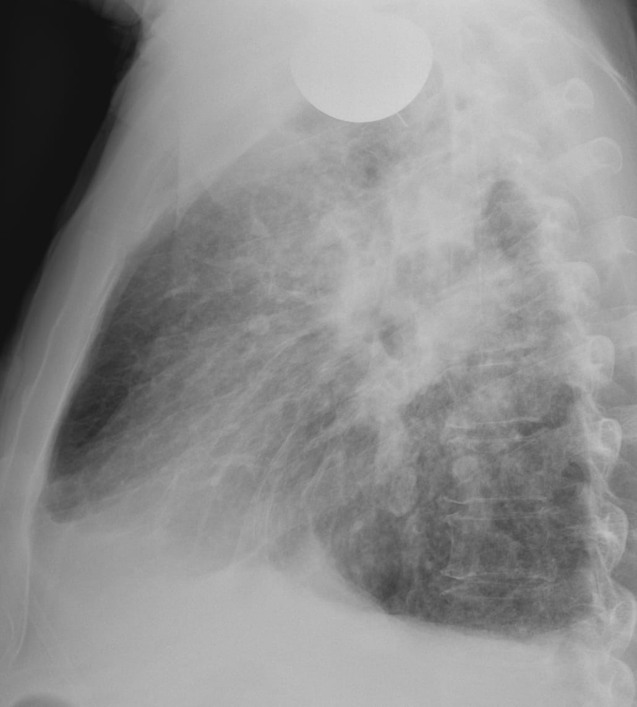]

If you were able to ask *one* question only about the patient, what would it be ? 

] <!--end of panel-->

.panel[.panel-name[Explication]

.pull-left[The patient's occupation!

.grey[Diagnosis]

Complicated Inorganic Pneumoconiosis]

.pull-right[

.grey[Findings]

* symmetric large upper lobe opacities
* foci of cicatrization emphysema peripheral to the opacities
* egg-shell mediastinal nodal calcifications

]


] <!--end of panel-->

] <!--end of panelset-->

---

class: inverse
name: case panelset

Case 6

.panelset[

.panel[.panel-name[Clinical Presentation]

.big[History: This person was stabbed with a knife.]


] <!--end of panel-->

.panel[.panel-name[Radiography]

.small[One finding deserves attention. What is it? And what should be done next ?]

```{r fig.align='center', out.width='50%'}
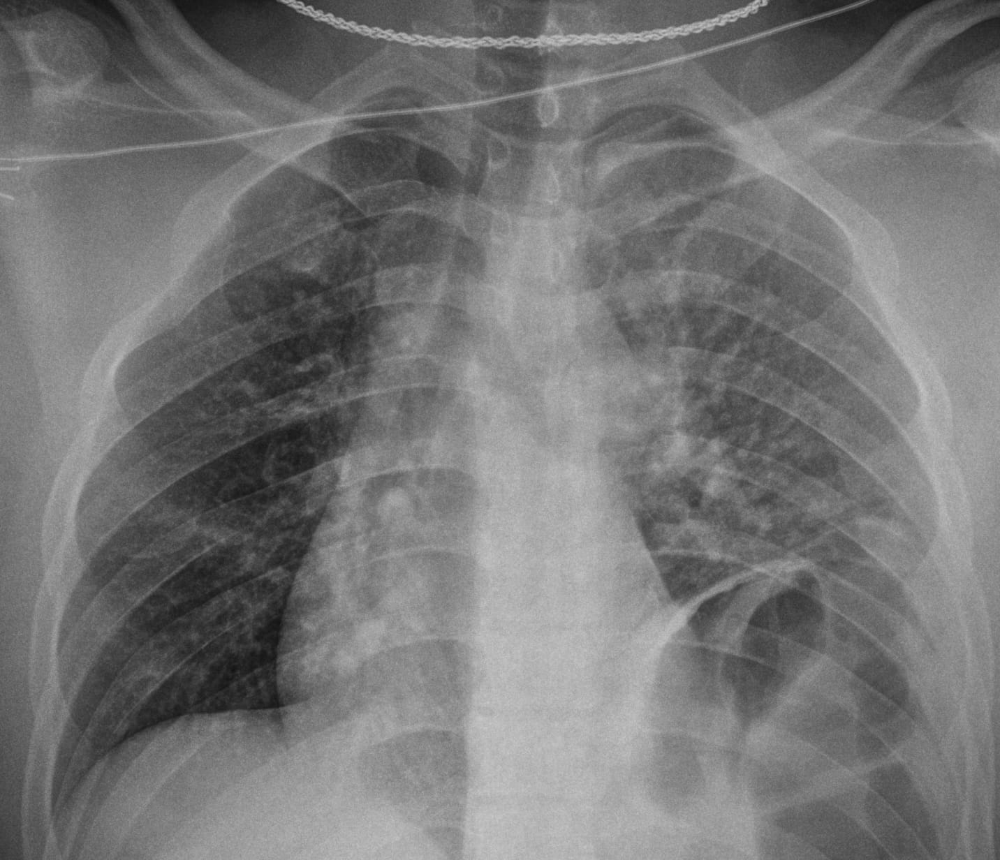
```

] <!--end of panel-->

.panel[.panel-name[Subsequent imaging]

<div style="text-align:center;">
<iframe class="pacsbin"
         id="case6"
         src="https://www.pacsbin.com/c/Z1b7CTovDP?s=614bd468de8c4b0152066f3b&i=614bd468de8c4b0152066f3c&ww=617&wc=117&an=false&header=false&notes=false&overlay=false" 
         style="width: 500px; height: 500px; border: 0;"></iframe>
</div>


] <!--end of panel-->

.panel[.panel-name[Explication]

.pull-left[* Substantial tear of left hemidiaphragm with herniation of abdominal contents into the chest.
* Diaphragm muscle retracts away from the laceration. 
* The laceration edges thicken and curl. 

.grey[Key Point]

Evaluate the hemidiaphram on coronal and sagittal projections. It's much easier to see the defect.  .yellow[ &rarr;]

]

.pull-right[

```{r fig.align='center', out.width='70%'}
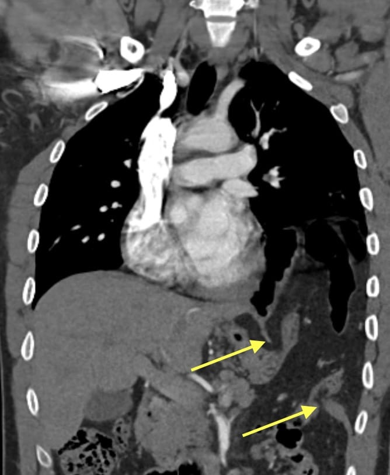
```


]


] <!--end of panel-->

] <!--end of panelset-->

---

class: inverse
name: case panelset

Case 7

.panelset[

.panel[.panel-name[Clinical Presentation]

.big[This patient with Rheumatoid Arthritis has clinical and spirometric evidence of expiratory airflow obstruction]


] <!--end of panel-->

.panel[.panel-name[Radiography]

.pull-left[

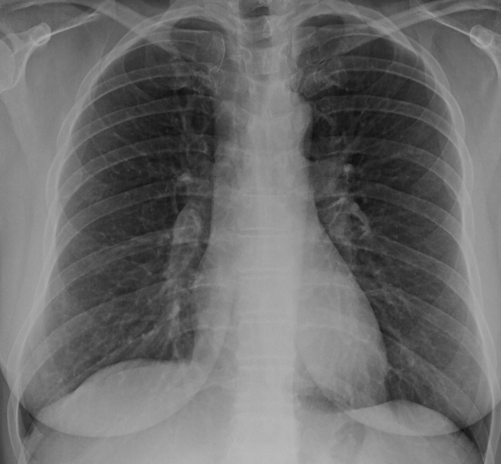]

.pull-right[

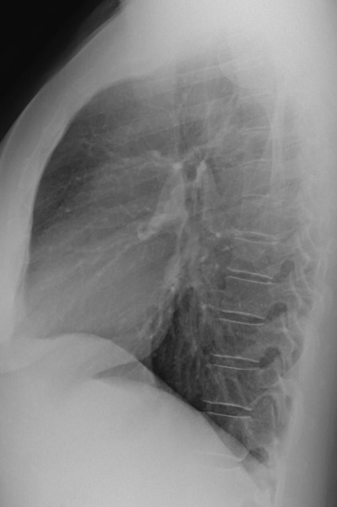]


] <!--end of panel-->

.panel[.panel-name[Imaging I]

<div style="text-align:center;">
<iframe class="pacsbin"
         id="case6"
         src="https://www.pacsbin.com/c/ZJglL43wvP?s=614bde7cde8c4b0152066f71&i=614bde7cde8c4b0152066f97&ww=1274&wc=-621&an=false&header=false&notes=false&overlay=false" 
         style="width: 500px; height: 500px; border: 0;"></iframe>
</div>


] <!--end of panel-->

.panel[.panel-name[Imaging II]

.grey[Expiration Series]

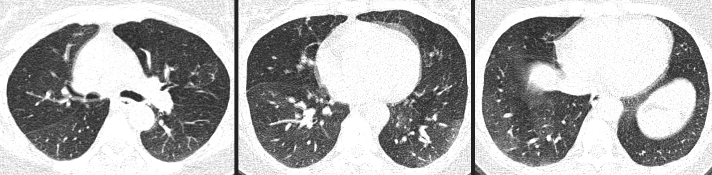

The findings are typical of a pathologic entity. What is it ?


] <!--end of panel-->


.panel[.panel-name[Explication]

.grey[Findings]

* mosaic attenuation pattern
* pattern shown to be due to air-trapping on Expiration Series


.grey[Tip]

You may need to change the window display settings -- Window Width and Center -- to see the mosaic pattern.


.grey[Diagnosis]

Constrictive Bronchiolitis

] <!--end of panel-->


] <!--end of panelset-->

---

class: inverse
name: case panelset

Case 8

.panelset[

.panel[.panel-name[Clinical Presentation]

.big[Another episode in a series of similar clinical presentations.]

] <!--end of panel-->

.panel[.panel-name[CXR]

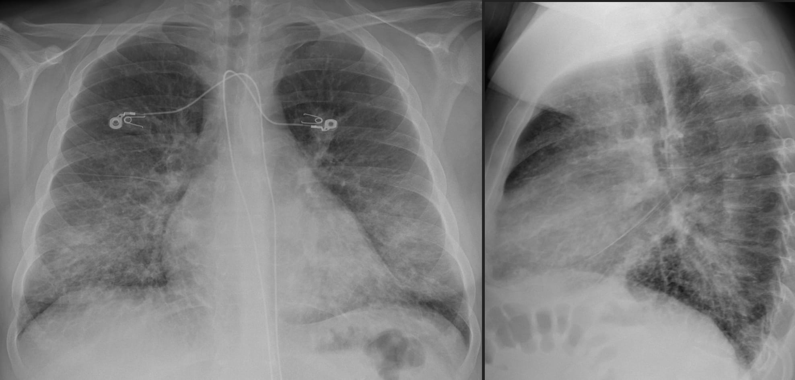

] <!--end of panel-->

.panel[.panel-name[Image when asymptomatic]

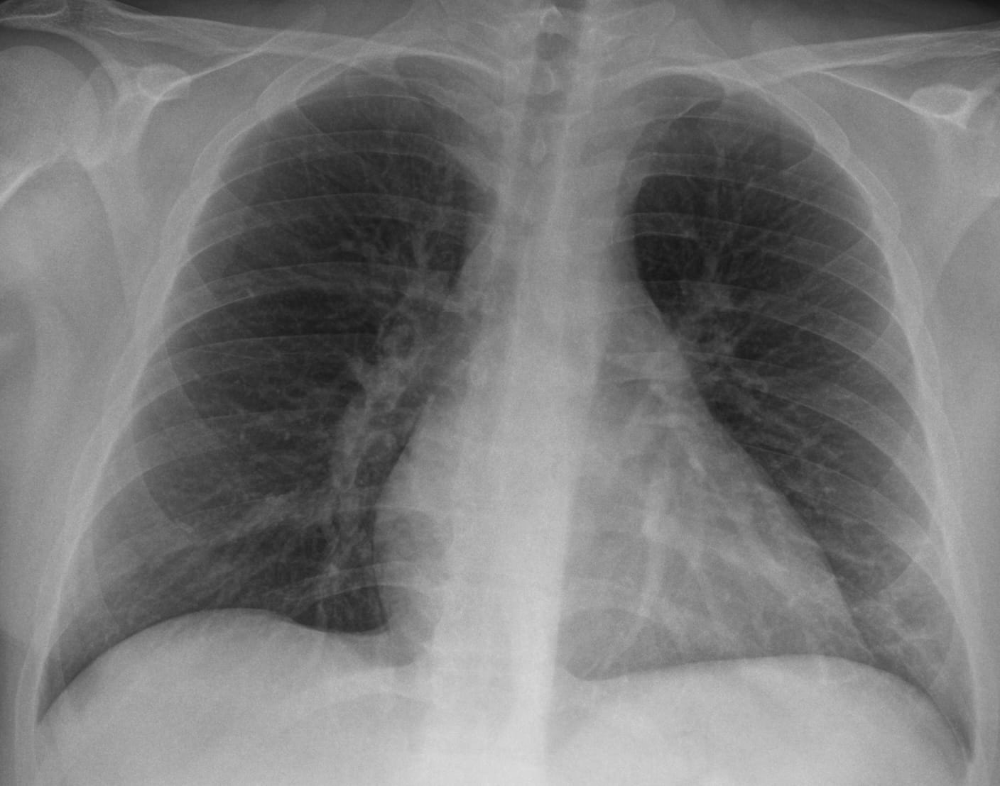

] <!--end of panel-->

.panel[.panel-name[CT]

.small[This was performed during a similar prior episode]

<div style="text-align:center;">
<iframe class="pacsbin"
         id="case8"
         src="https://www.pacsbin.com/c/-JX80NaDDv?s=614bf937de8c4b0152066fea&i=614bf937de8c4b0152066fef&ww=1543&wc=-474&an=false&header=false&notes=false&overlay=false" 
         style="width: 475px; height: 475px; border: 0;"></iframe>
</div>

] <!--end of panel-->

.panel[.panel-name[Explication]

.pull-left[
.grey[Imaging findings]

* interstitial edema (septal lines; peribronchial fluid cuffs; sub-pleural edema) and foci of alveolar edema.
* small pleural effusions
* distended SVC (widened *vascular pedicle*) and azygos vein, indicative of elevated CVP

.grey[Analysis]

These are findings of hypervolemic *hydrostatic* lung edema. 

The patient has chronic renal failure, is on dialysis, and experiences episodes of hypervolemia. 

]

.pull-right[

.grey[Vascular pedicle -- widened in hypervolemia]

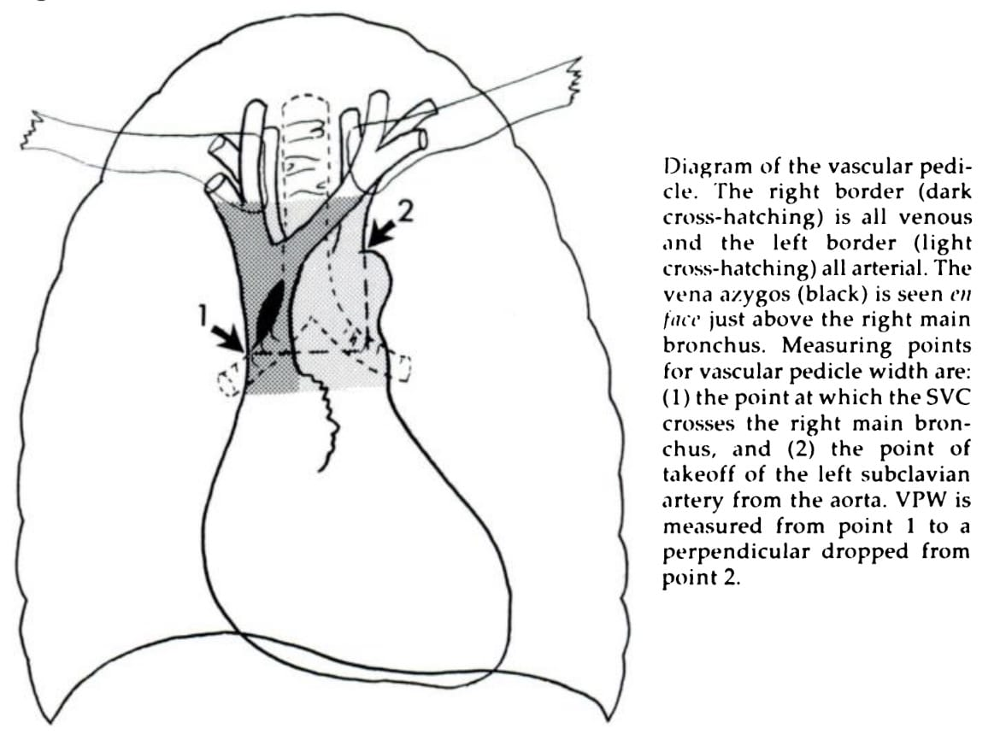


.small[Image from: Milne, et al. Radiology 1984; 152: 1-8]


]

] <!--end of panel-->

] <!--end of panelset-->

---

class: inverse
name: case panelset

Case 9

.panelset[

.panel[.panel-name[Clinical Presentation]

.big[A patient with persistent chest pain-discomfort]


] <!--end of panel-->

.panel[.panel-name[Radiography]

.pull-left[


]

.pull-right[

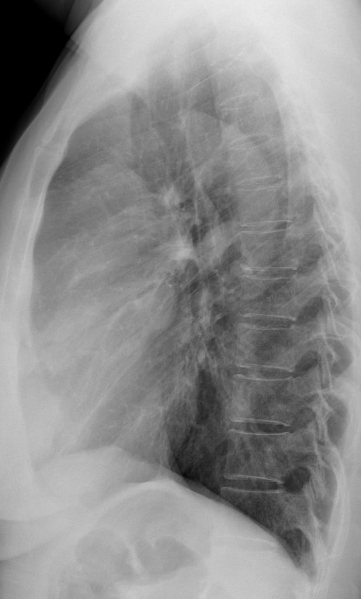

]

] <!--end of panel-->

.panel[.panel-name[Subsequent imaging]

.small[There's really only one possible diagnosis!]

<div style="text-align:center;">
<iframe class="pacsbin"
         id="case6"
         src="https://www.pacsbin.com/c/-1Lvt_XtPv?s=614e3213de8c4b015207c354&i=614e3213de8c4b015207c355&ww=597&wc=86&an=false&header=false&notes=false&overlay=false" 
         style="width: 450px; height: 450px; border: 0;"></iframe>
</div>


] <!--end of panel-->

.panel[.panel-name[Explication]

.pull-left[

.grey[Findings]

* an anterior mediastinal mass with...
* right intra-fissural pleural tumor  (see adjacent image)

This complex of findings is that of thymic tumor with so-called pleural "drop" metastases.

On histopathologic examination, this is a thymic carcinoma rather than the more-common thymoma.

]

.pull-right[

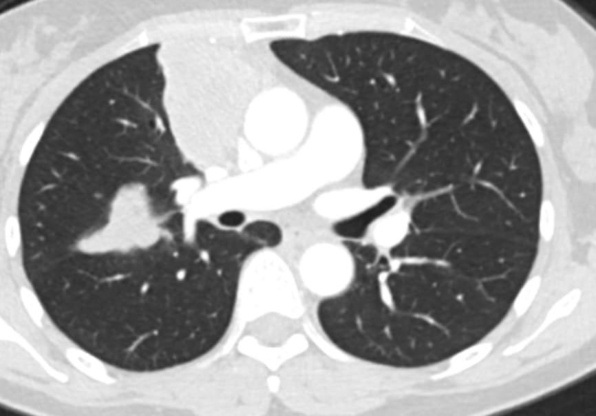


]


] <!--end of panel-->

] <!--end of panelset-->

---

class: inverse
name: case panelset

Case 10

.panelset[

.panel[.panel-name[Clinical Presentation]

.big[Blunt chest trauma]


] <!--end of panel-->

.panel[.panel-name[Radiograph]

.small[Do you see an abnormality?]

```{r fig.align='center', out.width='50%'}
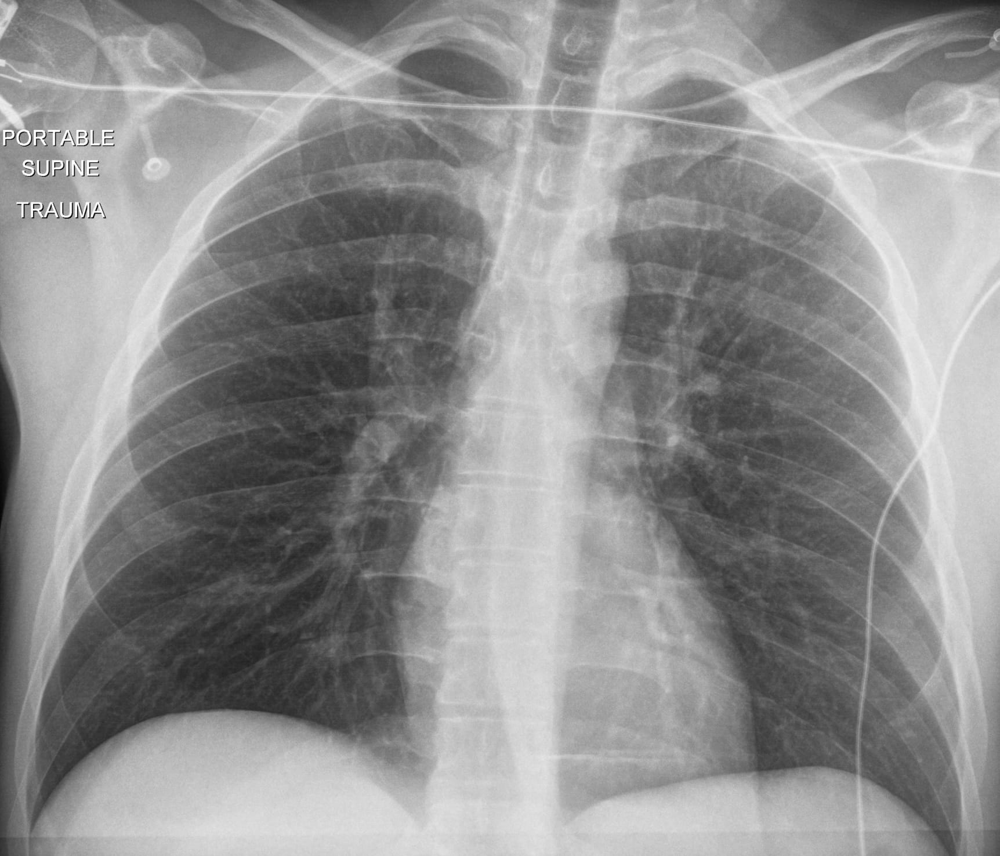
```


] <!--end of panel-->


.panel[.panel-name[Subsequent imaging]

What is the finding ? Can you relate it to the presentation and radiograph ? 

.pull-left[


]

.pull-right[

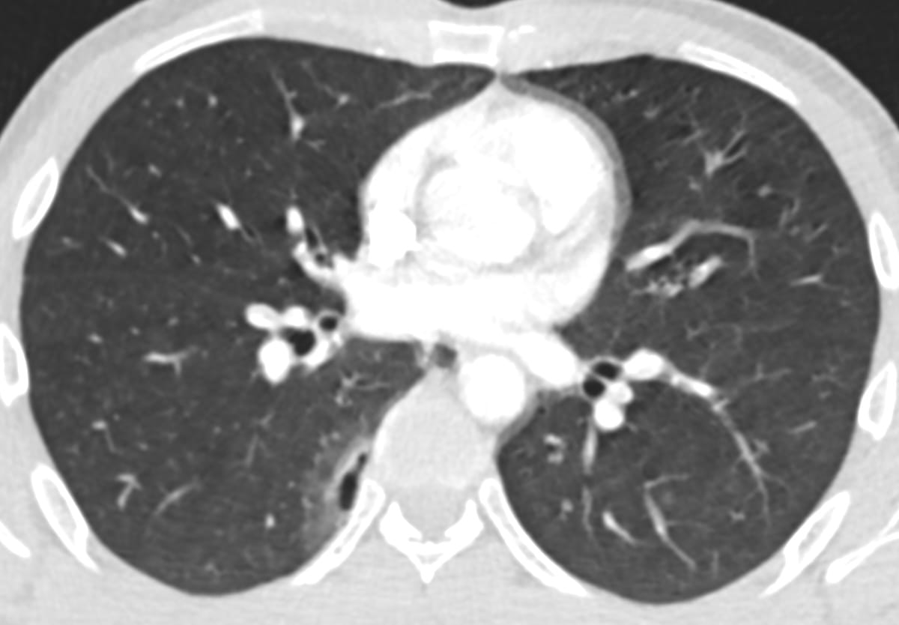

]


] <!--end of panel-->

.panel[.panel-name[Explication]

.pull-left[

.grey[Finding]

The subpleural right lung cystic space (invisible on radiography), with a small halo of ground glass opacity, is quite consistent with a traumatic lung cyst. 

Apical left rib fractures (yes, I know, very subtle!) are present.

This is a form of *contrecoup* injury. 

]

.pull-right[

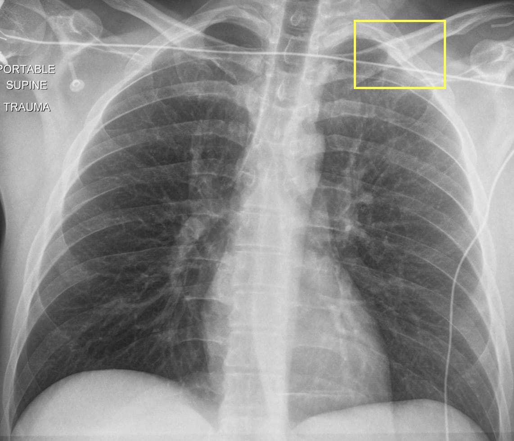

]


] <!--end of panel-->


] <!--end of panelset-->

---

class: inverse
name: case panelset

Case 11

.panelset[

.panel[.panel-name[Clinical Presentation]

.big[An unexpected imaging finding]


] <!--end of panel-->

.panel[.panel-name[Radiography]

.pull-left[

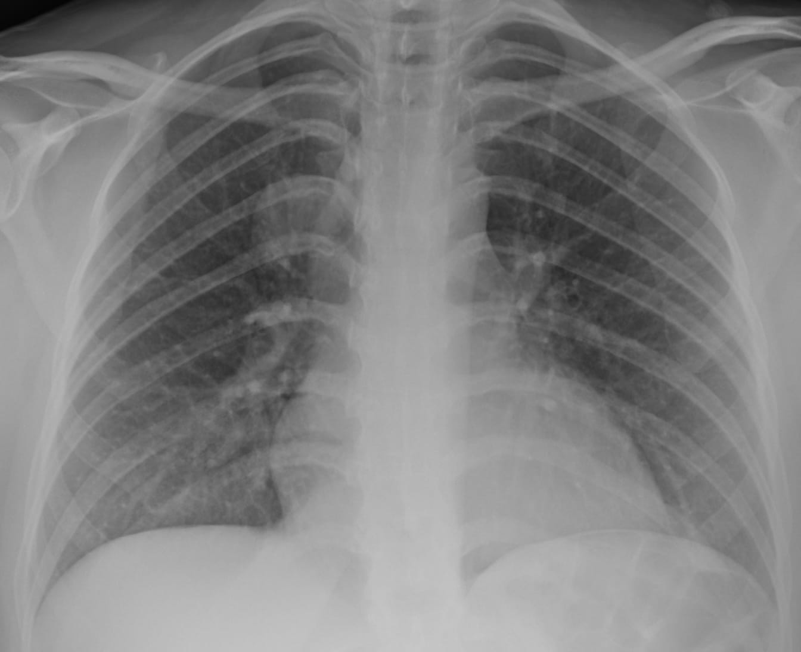]

.pull-right[

]

] <!--end of panel-->

.panel[.panel-name[Subsequent imaging]

.small[Suggest one diagnosis only!]

<div style="text-align:center;">
<iframe class="pacsbin"
         id="case6"
         src="https://www.pacsbin.com/c/ZkPQg6mtPv?s=614e3951de8c4b015207c3a9&i=614e3952de8c4b015207c3aa&ww=498&wc=74&an=false&header=false&notes=false&overlay=false" 
         style="width: 450px; height: 450px; border: 0;"></iframe>
</div>


] <!--end of panel-->

.panel[.panel-name[Explication]

.pull-left[

.grey[Findings]

* contrast-enhanced opacity
* an endobronchial component is present (images alongside) -- *tip of the iceberg* sign
* a few surrounding bronchi contain intra-luminal mucus (post-obstructive phenomenon)

.grey[Diagnosis]

Carcinoid Tumor

]

.pull-right[


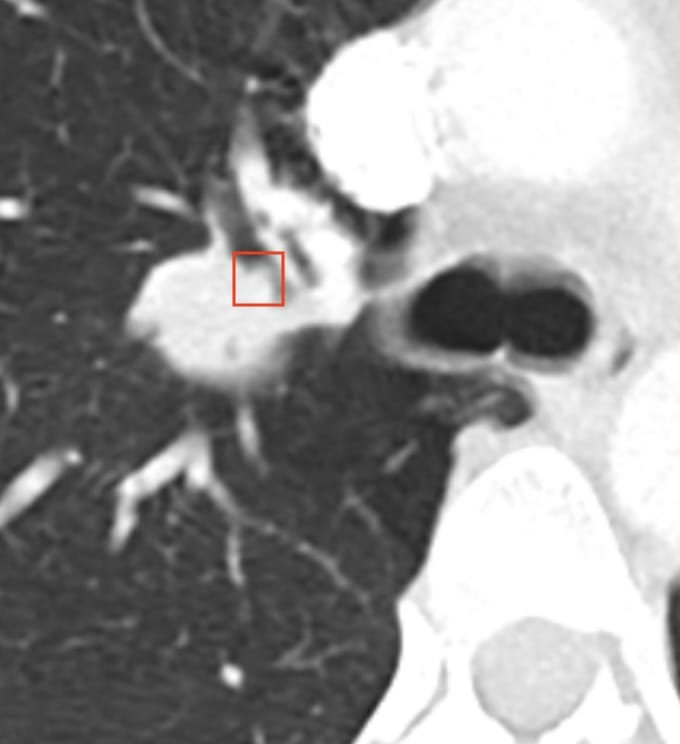

]


] <!--end of panel-->


] <!--end of panelset-->

---

class: inverse
name: case panelset

Case 12

.panelset[

.panel[.panel-name[Clinical Presentation]

.big[This person has no cardiorespiratory symptoms]


] <!--end of panel-->

.panel[.panel-name[Radiography]

.pull-left[

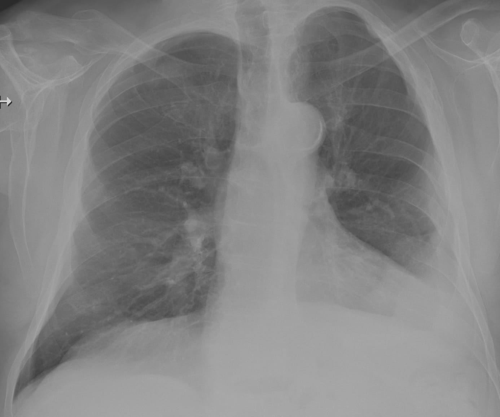]

.pull-right[

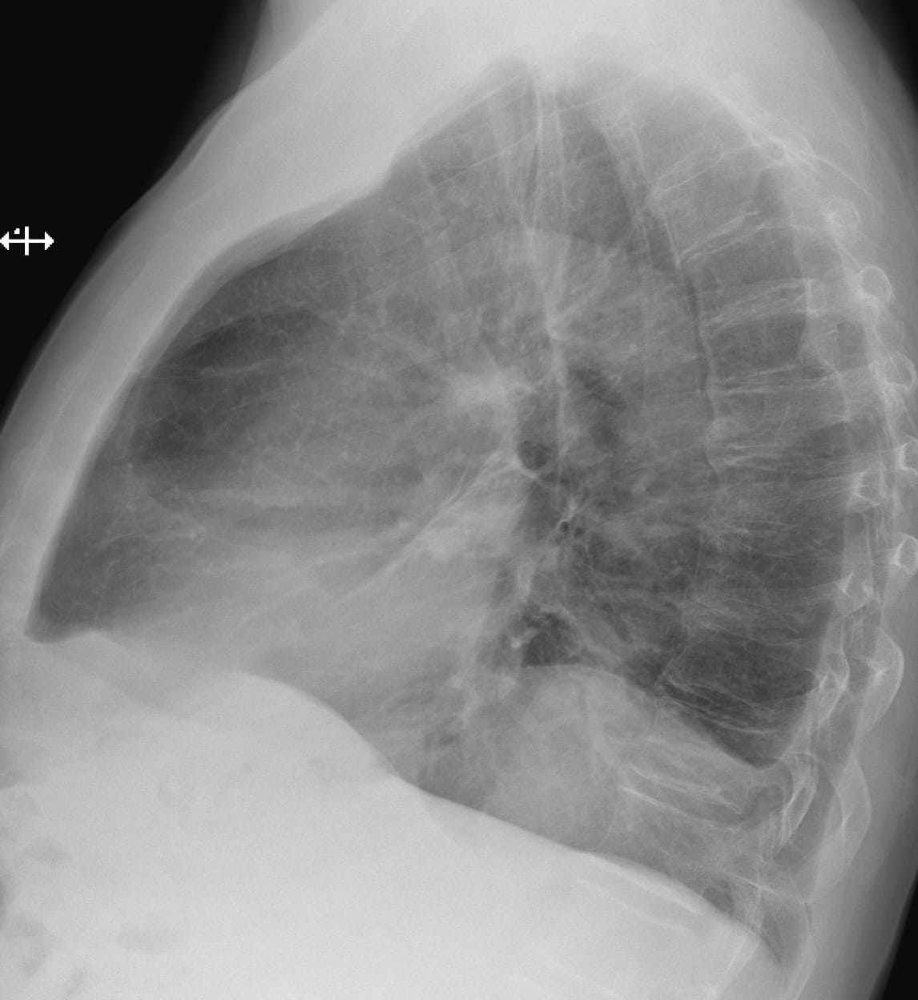]

] <!--end of panel-->

.panel[.panel-name[Subsequent imaging]


<div style="text-align:center;">
<iframe class="pacsbin"
         id="case6"
         src="https://www.pacsbin.com/c/W1KR3JNtPD?s=614e3d5cde8c4b015207c44b&i=614e3d5cde8c4b015207c44c&ww=401&wc=8&an=false&header=false&notes=false&overlay=false" 
         style="width: 450px; height: 450px; border: 0;"></iframe>
</div>


] <!--end of panel-->

.panel[.panel-name[MR years ago]

```{r fig.align='center', out.width='50%'}
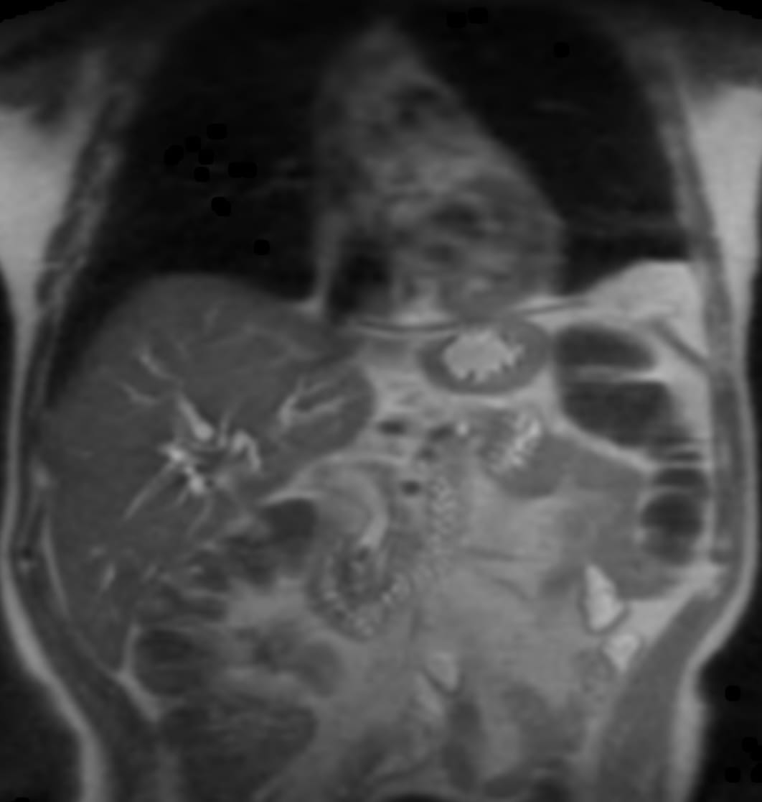
```

] <!--end of panel-->

.panel[.panel-name[Explication]

.pull-left[

.grey[Findings]

* a left hemidiaphragm defect is present   .yellow[ &rarr;] 
* mesenteric fat has herniated into the basal hemithorax
* multiple, healed left rib cage fractures are present
* MRI: shows a "chronic" defect

.grey[Diagnosis]

Chronic, unrepaired traumatic diaphragm rupture


]

.pull-right[


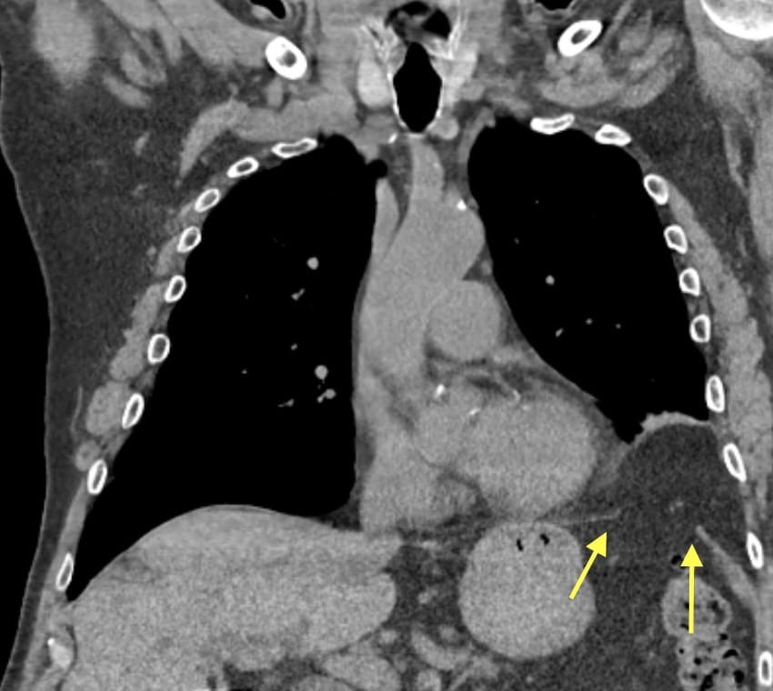


]


] <!--end of panel-->

] <!--end of panelset-->


---

class: inverse
name: case panelset

Case 13

.panelset[

.panel[.panel-name[Clinical Presentation]

.big[Findings of expiratory airflow obstruction on spirometry and low DLCO.]


] <!--end of panel-->

.panel[.panel-name[Radiography]

.small[CT scout images] 

.pull-left[

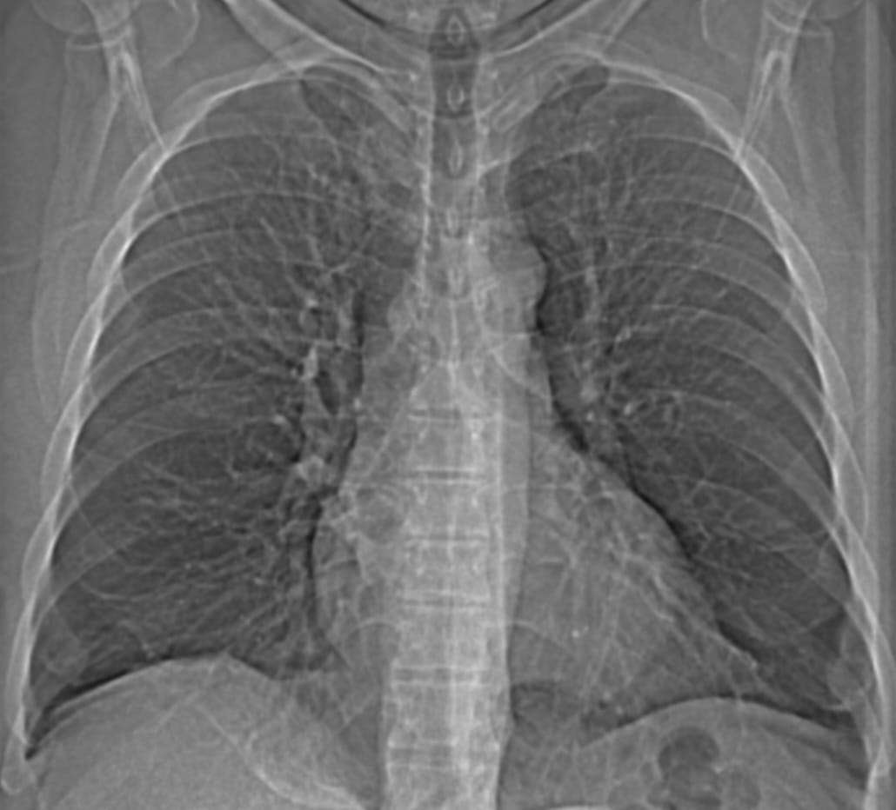]

.pull-right[

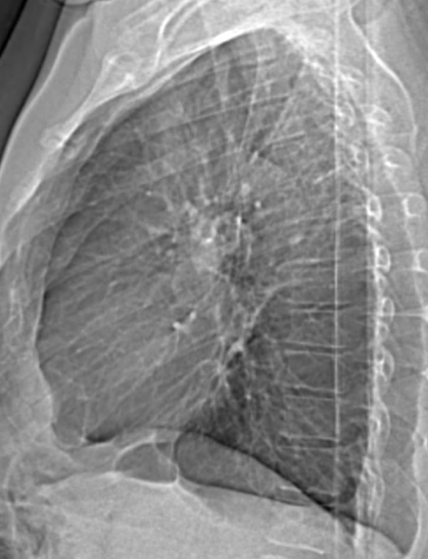]

] <!--end of panel-->

.panel[.panel-name[CT]


<div style="text-align:center;">
<iframe class="pacsbin"
         id="case6"
         src="https://www.pacsbin.com/c/-kRCkHEKvP?s=614e4540de8c4b015207d481&i=614e4540de8c4b015207d482&ww=1500&wc=-500&an=false&header=false&notes=false&overlay=false" 
         style="width: 450px; height: 450px; border: 0;"></iframe>
</div>


] <!--end of panel-->

.panel[.panel-name[Explication]

.pull-left[

.grey[Findings]

* basal-prdominant emphysema

.grey[Diagnosis]

Alpha-1 anti-trypsin deficiency

]

.pull-right[

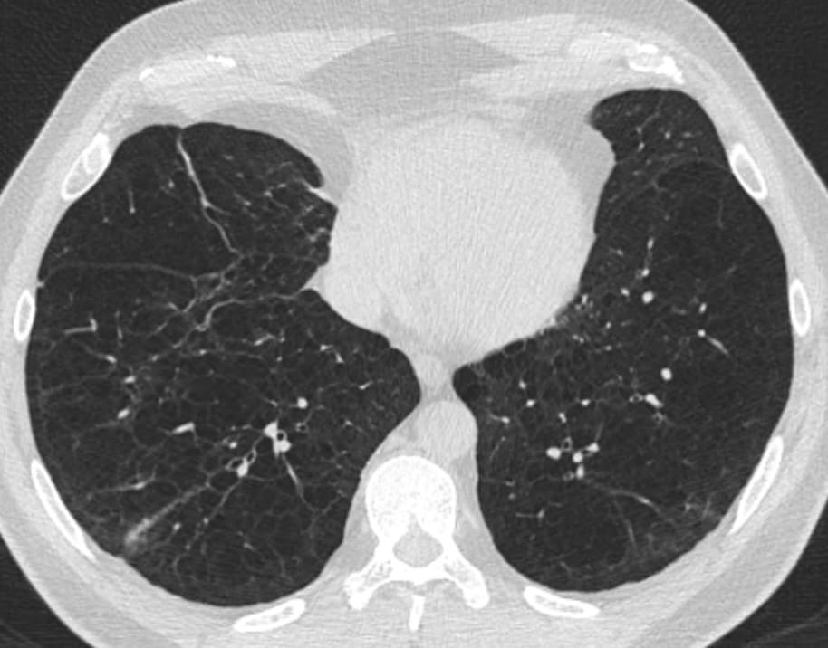


]

] <!--end of panel-->

] <!--end of panelset-->

---

class: inverse
name: case panelset

Case 14

.panelset[

.panel[.panel-name[Clinical Presentation]

.big[Blunt chest trauma]


] <!--end of panel-->

.panel[.panel-name[Radiography]

```{r fig.align='center', out.width='50%'}
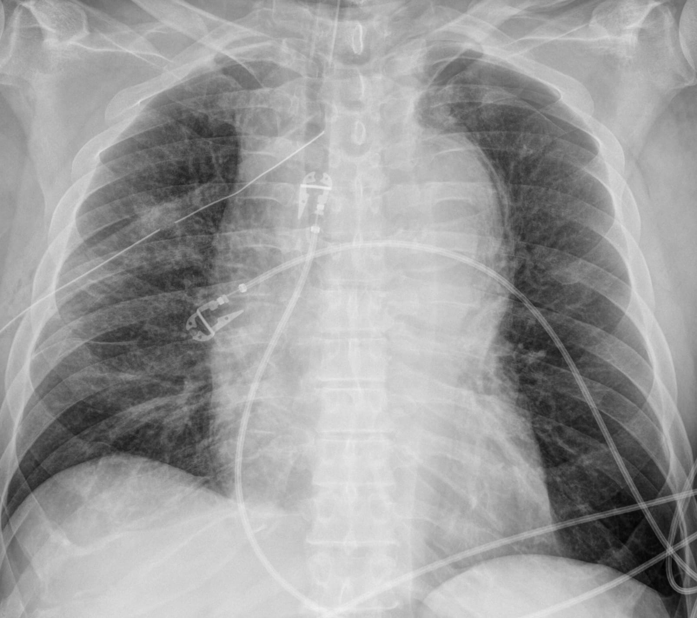
```

] <!--end of panel-->

.panel[.panel-name[CT]

.small[What's the prognosis?]

<div style="text-align:center;">
<iframe class="pacsbin"
         id="case6"
         src="https://www.pacsbin.com/c/-JycaUEYvP?s=614e48b8de8c4b015207e7e9&i=614e48b8de8c4b015207e7ea&ww=1097&wc=189&an=false&header=false&notes=false&overlay=false" 
         style="width: 450px; height: 450px; border: 0;"></iframe>
</div>


] <!--end of panel-->

.panel[.panel-name[Explication]

.pull-left[

.grey[Findings]

Type 4 Acute Traumatic Mural Injury with severe extra-aortic blood extravasation.

As you might anticipate, this was a fatal injury.

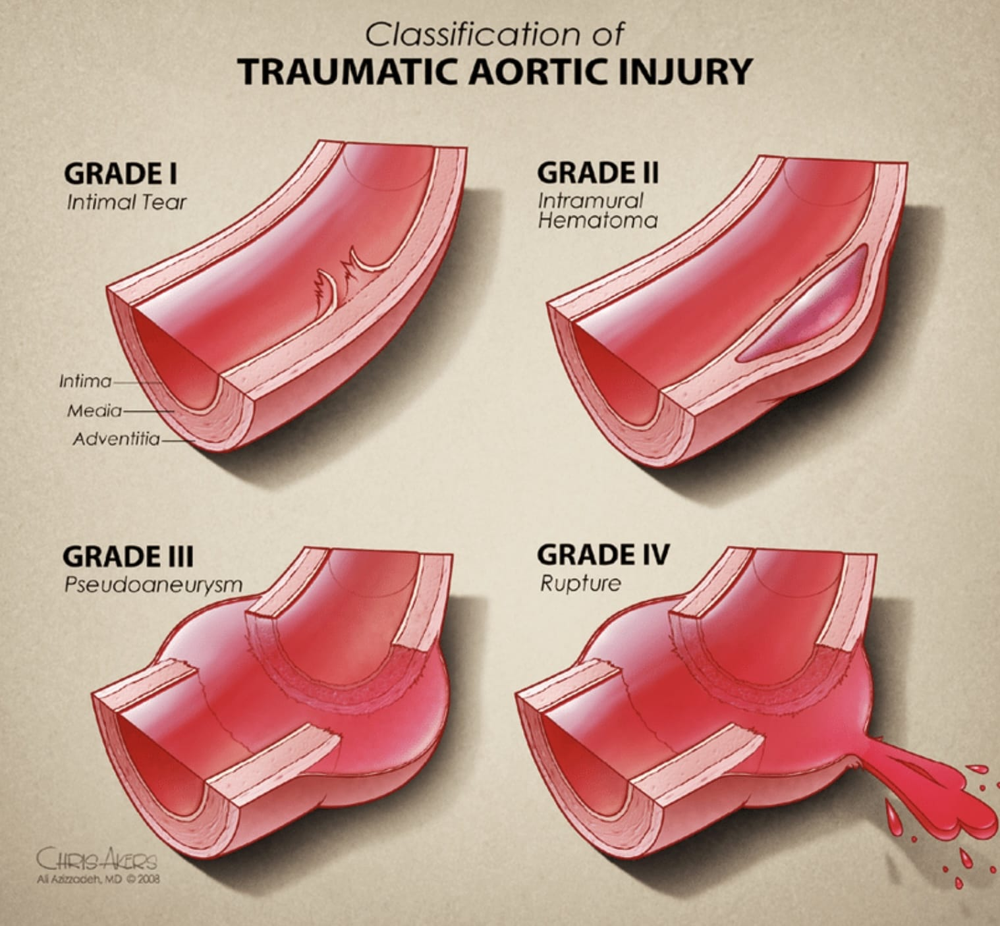

]

.pull-right[

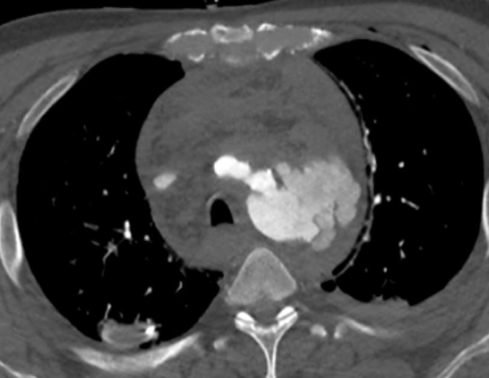


.smallest[Case courtesy of Jeff Kanne, M.D.]


]


] <!--end of panel-->

] <!--end of panelset-->

---

class: inverse
name: case panelset

Case 15

.panelset[

.panel[.panel-name[Clinical Presentation]

.big[A patient with polycythemia vera. A mediastinal mass was diagnosed.]


] <!--end of panel-->

.panel[.panel-name[Imaging]

.small[Should it be removed ?]

.pull-left[

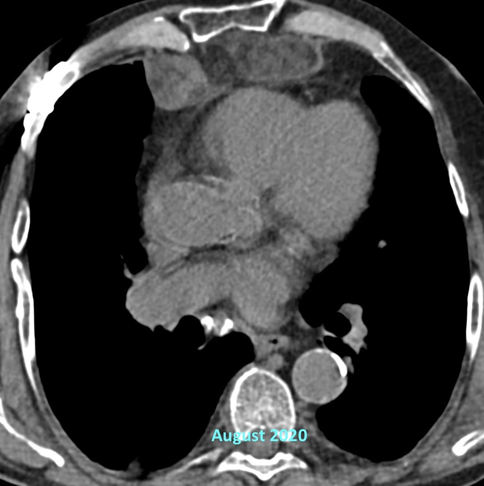]

.pull-right[

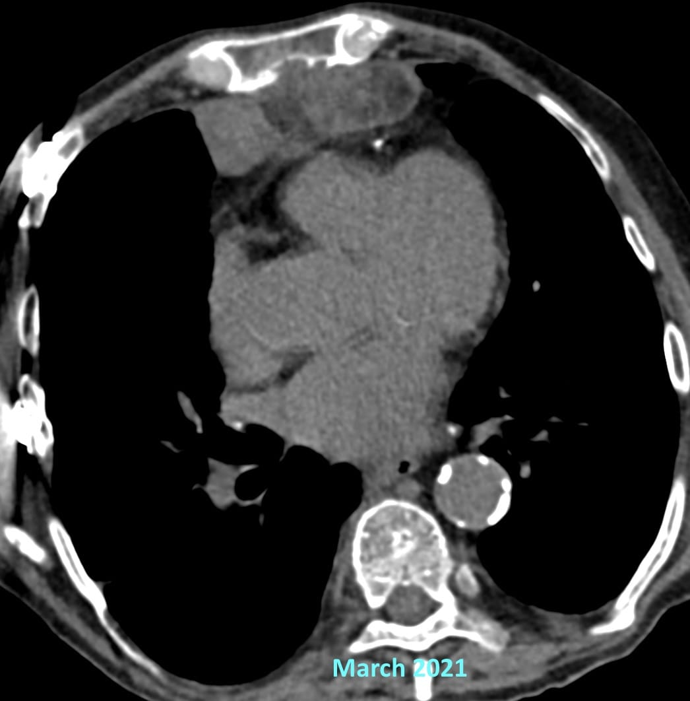]

] <!--end of panel-->

.panel[.panel-name[Explication]

.grey[Findings]

* circumscribed, fat-containing lesions, consistent with extra-medullary hematopoiesis
* as with idiopathic myelofibrosis, this may occur (in many locations) in polycythemia vera
* removal is not, of course, necessary


] <!--end of panel-->


] <!--end of panelset-->


```{css echo=FALSE}
.highlight-last-item > ul > li, 
.highlight-last-item > ol > li {
  opacity: 0.2;
}
.highlight-last-item > ul > li:last-of-type,
.highlight-last-item > ol > li:last-of-type {
  opacity: 1;
}
```

